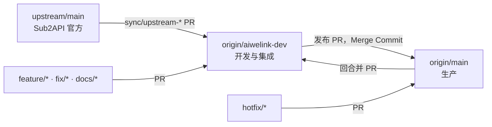

# AIWeLink Sub2API Git 工作流

本文档规定 AIWeLink 长期跟进 Sub2API 官方更新时的远端、分支、合并、冲突处理和发布方式。命名格式以 [AIWELINK_NAMING_CONVENTIONS.md](./AIWELINK_NAMING_CONVENTIONS.md) 为准；如果 `DEV_GUIDE.md` 中的 Git 命令与本文冲突，以本文为准。

## 1. 基本原则

1. `upstream` 只跟踪 `Wei-Shaw/sub2api` 官方仓库，不承载 AIWeLink 代码。
2. `origin/main` 是 AIWeLink 生产基线，`origin/aiwelink-dev` 是开发、上游同步和 CI 集成基线。
3. 普通开发、上游同步和发布都通过短期分支及 PR 完成，不直接向长期分支推送。
4. 后端优先采用 Sub2API 官方实现。AIWeLink 只保留明确批准的注册、推荐关系、OAuth 注册衔接及必要品牌/部署差异。
5. 上游同步保留 merge commit，不使用 rebase 或 squash 破坏上游祖先关系。
6. 冲突必须逐文件处理，不允许对整个目录或整个仓库盲目使用 `ours` 或 `theirs`。
7. 本地测试按风险和修改范围执行，GitHub 必需检查必须通过。

## 2. 远端和长期分支

| 引用 | 归属 | 作用 | 是否直接提交 |
| --- | --- | --- | --- |
| `upstream/main` | `Wei-Shaw/sub2api` | 本地保存的官方远端跟踪引用 | 否 |
| `origin/main` | AIWeLink | 实际生产代码和发布基线 | 否 |
| `origin/aiwelink-dev` | AIWeLink | 日常开发、上游同步、测试和 CI 集成 | 否 |
| 本地 `main` | 本机 | `origin/main` 的本地工作分支 | 否 |
| 本地 `aiwelink-dev` | 本机 | `origin/aiwelink-dev` 的本地工作分支 | 否 |

### 2.1 `origin/*` 和 `upstream/*` 不会自动更新

远端跟踪引用只是上一次 `fetch` 后的本地快照。看到 `upstream/main` 不代表它已经是官方最新状态。

```powershell
git remote -v
git fetch origin --prune
git fetch upstream --prune --tags
git log -1 --oneline origin/aiwelink-dev
git log -1 --oneline upstream/main
```

首次克隆后如果缺少 `upstream`：

```powershell
git remote add upstream git@github.com:Wei-Shaw/sub2api.git
git fetch upstream --prune --tags
```

每个克隆都必须禁用向官方仓库推送，并检查结果：

```powershell
git remote set-url --push upstream DISABLED
git remote get-url --push upstream
```

第二条命令必须输出 `DISABLED`。这只修改当前克隆的 Git 配置，不会替其他成员的克隆自动生效。

### 2.2 正常代码流向



除生产紧急修复外，不允许绕过 `aiwelink-dev` 直接把功能提交到 `main`。

## 3. 短期分支

| 分支 | 起点 | PR 目标 | 用途 |
| --- | --- | --- | --- |
| `feature/<name>` | `origin/aiwelink-dev` | `aiwelink-dev` | 新功能 |
| `fix/<name>` | `origin/aiwelink-dev` | `aiwelink-dev` | 普通缺陷修复 |
| `refactor/<name>` | `origin/aiwelink-dev` | `aiwelink-dev` | 不改变业务契约的重构 |
| `docs/<name>` | `origin/aiwelink-dev` | `aiwelink-dev` | 文档 |
| `test/<name>` | `origin/aiwelink-dev` | `aiwelink-dev` | 测试 |
| `chore/<name>` | `origin/aiwelink-dev` | `aiwelink-dev` | CI、构建或维护 |
| `sync/upstream-v<version>` | `origin/aiwelink-dev` | `aiwelink-dev` | 同步官方发布版本 |
| `hotfix/<name>` | `origin/main` | `main` | 紧急生产修复 |

短期分支合并后删除，不重复使用旧分支名。

## 4. 日常功能开发

### 4.1 创建分支

```powershell
git fetch origin --prune
git switch aiwelink-dev
git pull --ff-only origin aiwelink-dev
git switch -c feature/registration-invite-limit
```

工作区已有其他修改时，使用独立 worktree：

```powershell
git fetch origin --prune
git worktree add -b feature/registration-invite-limit `
  ..\sub2api-registration-invite-limit origin/aiwelink-dev
```

### 4.2 开发边界

新增后端逻辑前必须先检查官方实现：

```powershell
git fetch upstream --prune --tags
git log --all --oneline -- backend/internal/<related-path>
git grep -n "<keyword>" upstream/main -- backend
```

决策顺序：

1. 官方已有能力时，直接使用官方服务、接口和数据结构。
2. 官方能力只缺少注册业务衔接时，在最小扩展点增加 AIWeLink 适配。
3. 不复制官方的令牌刷新、配额、代理、计费或协议转换逻辑建立第二套实现。
4. 确实需要偏离官方时，在 PR 中记录原因、影响文件和以后删除该差异的条件。

### 4.3 提交和 PR

```powershell
git add <明确的文件列表>
git commit -m "feat(registration): add invite limit"
git push -u origin feature/registration-invite-limit
```

PR 目标为 `aiwelink-dev`。PR 描述至少包含：

- 目的和用户影响；
- 主要文件或模块；
- 与 Sub2API 官方实现的关系；
- 数据库、配置、环境变量和部署变化；
- 已执行的聚焦测试；
- 风险和回滚方式。

默认只创建 PR，不自动指定或请求个人审核者。是否允许合并由分支保护、必需检查和有权限的维护者决定。

## 5. 同步官方版本

优先同步官方发布 tag，而不是无法复现的“某次最新 `main`”。下面的 `$UpstreamTag` 必须替换为实际存在且已核验的官方 tag。

### 5.1 同步前检查

```powershell
$UpstreamTag = 'vX.Y.Z'
$UpstreamRef = "refs/remotes/upstream/tags/$UpstreamTag"
git status --short
git fetch origin --prune
git fetch upstream --prune
git ls-remote --exit-code --tags upstream "refs/tags/$UpstreamTag"
git fetch upstream "refs/tags/${UpstreamTag}:$UpstreamRef"
$UpstreamCommit = git rev-parse "$UpstreamRef^{commit}"
git merge-base --is-ancestor $UpstreamCommit upstream/main
if ($LASTEXITCODE -ne 0) { throw 'The selected tag is not in upstream/main' }
git show -s --format=fuller $UpstreamCommit
git log --left-right --oneline "origin/aiwelink-dev...$UpstreamCommit"
```

这里把官方 tag 写入 `refs/remotes/upstream/tags/*`，避免误用 `origin` 或本地残留的同名全局 tag。显式 fetch 因 tag 被改写而失败时，应停止并核对，不要使用强制 refspec 覆盖。

必须先确认：

- 本地工作区没有混入其他任务；
- tag 确实来自官方历史；
- 当前 `origin/aiwelink-dev` 已更新；
- 本次允许保留的 AIWeLink 差异清单已经写入 PR 草稿。

### 5.2 创建同步分支并开始合并

```powershell
$UpstreamTag = 'vX.Y.Z'
$UpstreamRef = "refs/remotes/upstream/tags/$UpstreamTag"
$UpstreamCommit = git rev-parse "$UpstreamRef^{commit}"
$SyncBranch = "sync/upstream-$UpstreamTag"
git switch -c $SyncBranch origin/aiwelink-dev
git merge --no-ff --no-commit $UpstreamCommit
```

使用 `--no-commit` 是为了在没有冲突时也先检查范围。确认后再提交 merge commit：

```powershell
git status
git diff --cached --stat
git commit
git push -u origin $SyncBranch
```

同步 PR 的目标是 `aiwelink-dev`，合并方式必须为 Merge Commit。

## 6. 冲突处理

### 6.1 先确认 `ours` 和 `theirs`

第 5.2 节的 `git merge --no-ff --no-commit $UpstreamCommit` 产生冲突后，可用下面的命令确认当前分支和实际合入对象。不要再次执行 merge：

```powershell
git branch --show-current
git rev-parse MERGE_HEAD
git show -s --oneline MERGE_HEAD
```

- `ours` 是当前同步分支，也就是合并前的 AIWeLink `aiwelink-dev` 状态；
- `theirs` 是 `MERGE_HEAD` 指向的官方版本。

这个含义只适用于当前 merge。执行 rebase 时，Git 会把“正在重放到的基线”视为 `ours`，容易与直觉相反，因此上游同步禁止用 rebase。

### 6.2 查看冲突

```powershell
git status
git diff --name-only --diff-filter=U
git ls-files -u
```

查看单个文件的三方内容：

```powershell
git show :1:path/to/file   # merge base
git show :2:path/to/file   # ours，AIWeLink 当前版本
git show :3:path/to/file   # theirs，Sub2API 官方版本
```

确认某个文件确实应完整采用一侧后，才可以使用：

```powershell
git restore --ours -- path/to/file
git restore --theirs -- path/to/file
git add path/to/file
```

禁止使用下面的整仓库或整目录操作：

```text
git checkout --ours .
git checkout --theirs .
git restore --ours -- backend
git restore --theirs -- frontend
```

这些命令会把范围内所有冲突文件一次性选成同一侧，容易丢失另一侧的官方修复或 AIWeLink 注册逻辑。已自动合并且不处于 unmerged 状态的文件通常不受 `--ours`/`--theirs` 影响，但仍必须通过逐文件检查确认最终结果。

### 6.3 按文件归属决策

| 文件类别 | 默认决策 |
| --- | --- |
| 官方通用后端、协议、配额、代理、计费 | 优先官方实现，再把确有必要的注册衔接放回最小扩展点 |
| 注册、推荐关系、OAuth pending session | 三方逐段合并，保留已批准的 AIWeLink 业务契约和安全边界 |
| 管理控制台、监控面板、普通 UI | 接受官方 UI 演进，不恢复已明确撤回的 PR #29 AIWeLink 控制台 overlay |
| 登录、注册页面 | 官方组件结构优先，只保留注册流程所需的最小 AIWeLink 差异 |
| `README*`、Logo、GitHub 首页内容 | 保留 AIWeLink 品牌内容，手工同步官方版本和工具链事实 |
| `VERSION`、`UPSTREAM_VERSION` | 人工按第 8 节设置，不能盲选任一侧 |
| `go.mod`、`package.json` | 先合并直接依赖和工具链要求，再重新生成校验文件 |
| `go.sum`、`pnpm-lock.yaml`、生成代码 | 先解决源文件，再用仓库标准工具生成，不手工拼接冲突标记 |
| 数据库 schema 和迁移 | 保留双方有效迁移，检查编号、顺序、幂等性和回滚影响 |
| GitHub Actions、Docker、部署配置 | 逐项合并触发条件、权限、secret 名称和发布门槛 |

遇到 modify/delete 或 rename/delete 冲突时，先查官方是否已提供替代文件。需要保留 AIWeLink 行为时，应迁移到官方的新扩展点，不要直接复活整份旧文件。

### 6.4 生成文件和锁文件

根据冲突范围选择命令，不要为纯文档同步更新依赖：

```powershell
# Go 依赖确有变化时
Set-Location backend
go mod tidy

# Ent schema 确有变化时
go generate ./ent

# 前端依赖确有变化时
Set-Location ../frontend
pnpm install --lockfile-only
```

生成后再次检查 `git diff --stat`，避免工具升级导致无关的大范围重写。

### 6.5 中止错误合并

尚未提交 merge commit 时：

```powershell
git merge --abort
```

如果合并已经进入远端或 PR，不改写长期分支历史。基于最新目标分支创建 `fix/revert-<name>`，使用 `git revert` 生成可审计的回退提交，再走 PR。

## 7. PR #31 后的特殊历史说明

PR #29 的 merge commit `ec1cd4381` 已进入 `aiwelink-dev` 历史，随后由 PR #31 中的 `de1ec7567` 回退。因此，Git 仍认为 PR #29 的祖先提交“已经合并”，但对应代码内容已经被撤销。

这会带来一个重要后果：以后直接合并更高版本 tag，Git 可能只带入 PR #29 之后的新提交，不会自动恢复被 `de1ec7567` 撤销的官方内容。

后续重新同步时必须：

1. 创建新的专用 `sync/upstream-*` 分支；
2. 用两棵树直接比较当前开发分支和目标官方 tag：

   ```powershell
   $UpstreamTag = 'vX.Y.Z'
   git diff --name-status origin/aiwelink-dev $UpstreamTag
   git diff --stat origin/aiwelink-dev $UpstreamTag
   ```

3. 单独列出官方代码、AIWeLink 注册差异、品牌/部署差异和已拒绝的 PR #29 UI overlay；
4. 重建缺失的官方基线后再处理更高版本的新提交；
5. 通过独立 PR 验证，不把“revert the revert”直接合入长期分支。

不要直接回退 `de1ec7567` 后提交，因为这会同时恢复已拒绝的 PR #29 控制台 UI 和其他 overlay。该场景必须采用显式允许清单逐项重建。

## 8. 版本识别和命名

版本格式为：

```text
<upstream-version>-<aiwelink-revision>[.<subrevision>...]
```

例如首次基于官方 `0.1.177` 发布 AIWeLink 版本：

```text
backend/cmd/server/UPSTREAM_VERSION = 0.1.177
backend/cmd/server/VERSION          = 0.1.177-1
Git tag                             = v0.1.177-1
Docker tag                          = 0.1.177-1
```

只有完成目标官方版本的代码同步和验证后，才能更新这两个版本文件。只合入部分安全修复或注册逻辑时，不得声称已完成该上游版本同步。

版本检查：

```powershell
bash backend/scripts/validate-version.sh
bash backend/scripts/validate-version.sh v0.1.177-1
```

Go 版本以 `backend/go.mod` 为唯一基线，CI 和 Dockerfile 应读取或校验该文件，不在文档里长期硬编码工具链版本。

## 9. 聚焦验证

本地验证按实际改动执行，不要求每个小 PR 重复全量测试。

| 改动 | 最低本地验证 |
| --- | --- |
| 纯 Markdown | 链接/路径检查、`git diff --check` |
| 注册或 OAuth | 对应 handler/service 和前端 auth 测试 |
| 令牌刷新 | token refresh、401、退出和账号切换测试 |
| 依赖或工具链 | 版本脚本、依赖安装、相关构建或类型检查 |
| 数据库迁移 | 迁移专项测试和测试环境验证 |
| 安全修复 | 聚焦单测、静态检查及 CodeQL |
| 上游大版本同步 | 冲突相关测试、版本检查、CI 全部门槛 |

完成冲突处理后至少执行：

```powershell
git diff --name-only --diff-filter=U
git diff --check
bash backend/scripts/validate-version.sh
```

第一条必须没有输出。其余测试命令和结果写入 PR，GitHub 必需检查失败时不得合并。

## 10. 合并策略和仓库保护

| PR 类型 | 合并方式 |
| --- | --- |
| 普通 `feature/*`、`fix/*`、`docs/*` 到 `aiwelink-dev` | Squash Merge 或 Merge Commit |
| `sync/upstream-*` 到 `aiwelink-dev` | Merge Commit |
| `aiwelink-dev` 到 `main` | Merge Commit |
| `hotfix/*` 到 `main` | Merge Commit |
| `main` 回合并到 `aiwelink-dev` | Merge Commit |

截至 2026-08-14 的 GitHub 配置快照：

- 仓库允许 Merge Commit 和 Squash Merge，禁用 Rebase Merge，合并后自动删除短期分支；
- `aiwelink-dev` 要求分支为最新状态并通过 `ci-gate`；
- `main` 要求分支为最新状态并通过 `shell`、`test`、`frontend`、`golangci-lint`、`backend-security`、`frontend-security` 和 `compose`；
- 两个长期分支禁止强制推送和删除，并要求解决审查对话；
- 保护规则当前保留一票审核要求，同时为指定维护者配置 bypass。日常流程只创建 PR，不自动向个人发送审核申请。

配置可能变化，需要现场核对时：

```powershell
gh api repos/AIwelink/sub2api-aiwelink-dev/branches/aiwelink-dev/protection
gh api repos/AIwelink/sub2api-aiwelink-dev/branches/main/protection
```

## 11. 发布和热修复

### 11.1 正常发布

1. 更新 `aiwelink-dev` 上的版本文件并通过版本检查；
2. 创建 `aiwelink-dev -> main` PR；
3. 使用 Merge Commit；
4. 从 `main` 创建与 `VERSION` 一致的 tag；
5. 部署并验证生产健康检查和关键注册流程；
6. 如果 `main` 产生发布或热修复提交，通过 PR 回合并到 `aiwelink-dev`。

### 11.2 热修复

```powershell
git fetch origin --prune
git switch -c hotfix/payment-callback-timeout origin/main
```

热修复合并到 `main` 并发布后，必须立即创建 `main -> aiwelink-dev` 回合并 PR，避免下一次发布覆盖修复。

## 12. 回退流程

不要对已共享的 `main` 或 `aiwelink-dev` 使用 `reset --hard` 或强制推送。

回退已经合并的普通 PR：

```powershell
git fetch origin --prune
git switch -c fix/revert-pr-123 origin/aiwelink-dev
git revert <squash-or-feature-commit>
git push -u origin fix/revert-pr-123
```

回退 merge commit 时必须确认主线父提交：

```powershell
$MergeCommit = '<merge-commit-sha>'
git show -s --format="%H %P" $MergeCommit
$MainlineParent = 1  # GitHub 标准 PR merge 通常为 1，必须根据上一条输出确认
git revert -m $MainlineParent $MergeCommit
```

回退后仍通过 PR 合入。PR 必须说明为什么回退、会移除什么、保留什么、如何重新实现和验证。

## 13. PR 模板

```markdown
## 目的

## 范围

## 与上游的关系
- 官方已提供：
- AIWeLink 必须保留：
- 本次明确不包含：

## 冲突处理
| 文件/模块 | 决策 | 原因 |
| --- | --- | --- |

## 版本
- 上游版本：
- AIWeLink 版本：

## 验证
- `command`：结果

## 风险与回滚
```

## 14. 合并前检查清单

- [ ] 分支从最新的正确基线创建；
- [ ] 没有未解决冲突和冲突标记；
- [ ] 没有整目录盲选 `ours` 或 `theirs`；
- [ ] 通用后端优先使用官方实现；
- [ ] 只保留明确批准的 AIWeLink 注册、品牌和部署差异；
- [ ] 没有恢复已拒绝的 PR #29 控制台 UI overlay；
- [ ] `VERSION`、`UPSTREAM_VERSION`、tag 和镜像版本一致；
- [ ] 聚焦测试及 GitHub 必需检查通过；
- [ ] PR 写明风险、回滚和下一次同步影响；
- [ ] 未自动请求个人审核者。
