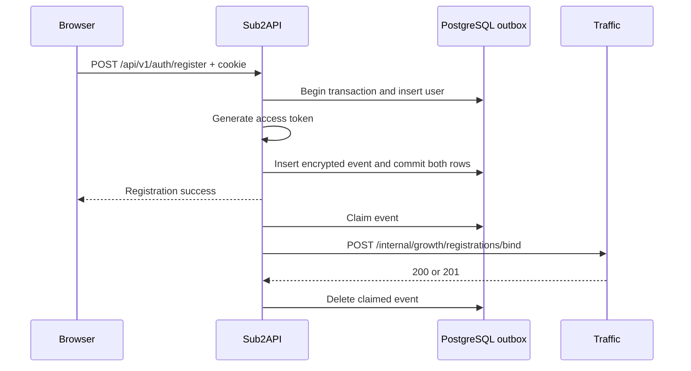

# Growth Registration Binding Design

**Date:** 2026-08-09

## Goal

Bind a successful ordinary email registration in Sub2API to the promotion session established by the Traffic-owned `/r/{code}` flow. The local user row and durable outbox event commit atomically, while Traffic availability remains outside the synchronous registration path.

## Scope

- Sub2API only consumes the configured promotion-session cookie.
- The only HTTP request inspected is `POST /api/v1/auth/register`.
- The user is prepared first, the access token is generated, and then the user row and registration event commit in one PostgreSQL transaction.
- Missing or invalid promotion cookies produce a registration event with `growth_session: null`.
- The feature is opt-in and disabled by default.

## Explicit Non-Goals

- Do not add or modify `/r/{code}` in Sub2API.
- Do not modify the Traffic service or its `/internal/growth/registrations/bind` implementation.
- Do not modify `/internal/growth/logins`.
- Do not record OAuth, SSO, passkey, or login activity.
- Do not reuse or change Sub2API native affiliate and invitation-code binding.

## Data Flow

1. The Traffic-owned `/r/{code}` flow establishes a cookie such as `awl_growth_sid`.
2. `GrowthRegistrationSession` runs only for the exact ordinary registration method and path.
3. A valid cookie value is copied into the request context; the middleware never changes the request body.
4. `AuthService.RegisterWithVerification` opens an Ent transaction and creates the user without committing it.
5. The service generates the access token, then `GrowthRegistrationRecorder` creates a fresh source UUID, encrypts the promotion session, and inserts the outbox event through the same transaction.
6. The user and outbox event commit together before registration success is returned.
7. Existing post-registration bootstrap work remains best-effort and outside the transaction.
8. `GrowthRegistrationWorker` claims available rows and sends the stable payload to the configured Traffic endpoint.
9. A `200` or `201` response deletes the claimed row. Retryable failures are rescheduled; permanent failures are dead-lettered.



## Stable Delivery Contract

The worker sends:

```json
{
  "site_id": "aiwelink",
  "external_user_id": "92",
  "source_registration_id": "8f4e59ce-2eb0-4d24-97d1-c248918da19e",
  "registered_at": "2026-08-09T12:00:00Z",
  "growth_session": "promotion-session"
}
```

- `external_user_id` is the decimal Sub2API user ID.
- `source_registration_id` is generated once when the outbox row is created and provides idempotency.
- `registered_at` is UTC and serialized as RFC3339Nano.
- `growth_session` is nullable.
- Requests use `Authorization: Service <credential>`, `Content-Type: application/json`, and a fresh `X-Request-ID`.

## Outbox Model

`backend/migrations/194_growth_registration_outbox.sql` defines a durable queue with:

- a unique `source_registration_id`;
- site, external user, registration timestamp, and encrypted session fields;
- availability, attempt, lease owner, and lease timestamp fields;
- bounded response metadata for operations and diagnosis;
- a dead-letter timestamp.

Workers claim with `FOR UPDATE SKIP LOCKED`. Claim transitions require the same worker ID, and expired claims are eligible for recovery. Dead-letter transitions clear the encrypted session value.

## Failure Semantics

- Local durable enqueue is fail-closed. Token generation, encryption, outbox insertion, or a known transaction failure prevents a success response and rolls back the user and event together.
- The recorder detaches request cancellation and bounds the insert operation so a client disconnect does not interrupt a transaction that is already preparing the durable registration.
- Traffic delivery is asynchronous and fail-open with respect to registration: Traffic, DNS, TLS, or network outages cannot roll back a committed user and outbox event.
- Disabled configuration produces a no-op runtime.
- Enabled configuration with a missing repository, credential, site ID, encryption key, endpoint, or positive timeout fails application startup.
- Transport failures and HTTP `408`, `425`, `429`, `500`, `502`, `503`, and `504` responses use bounded jittered exponential backoff.
- Empty, malformed, oversized, or unreadable bodies retain the HTTP status classification: retryable statuses are rescheduled and permanent statuses are dead-lettered.
- Other HTTP responses and decryption failures are dead-lettered.
- Outbox transition failures retain the row for lease recovery.

## Security Boundaries

- Promotion sessions are limited to 64 bytes.
- Sessions are encrypted with AES-256-GCM using a random nonce and fixed versioned additional authenticated data.
- The database never stores the session in plaintext.
- Logs do not include the session, credential, response body, or ciphertext.
- The encryption key is exactly 32 bytes encoded as 64 hexadecimal characters.
- HTTP endpoints are accepted only for explicit private hosts. Public endpoints require HTTPS.
- Private HTTP delivery bypasses environment proxies. HTTPS honors the environment proxy.
- Redirects are rejected so service credentials cannot be forwarded to another host.
- Only `*http.Transport` is accepted and cloned; arbitrary custom round trippers are rejected.
- Connect and response-header timeouts are bounded by configuration.
- Response headers are limited to 16 KiB and response bodies to 4 KiB.

## Configuration

| Environment variable | Default | Purpose |
| --- | --- | --- |
| `GROWTH_REGISTRATION_ENABLED` | `false` | Enables middleware, recorder, and worker behavior. |
| `GROWTH_REGISTRATION_ENDPOINT` | Docker: `http://traffic:8081/internal/growth/registrations/bind` | Traffic binding endpoint. |
| `GROWTH_REGISTRATION_SITE_ID` | `aiwelink` | Stable site identifier sent to Traffic. |
| `GROWTH_REGISTRATION_SERVICE_CREDENTIAL` | empty | Service authorization credential. |
| `GROWTH_REGISTRATION_OUTBOX_ENCRYPTION_KEY` | empty | AES-256-GCM key; generate with `openssl rand -hex 32`. |
| `GROWTH_REGISTRATION_COOKIE_NAME` | `awl_growth_sid` | Promotion-session cookie read at registration. |
| `GROWTH_REGISTRATION_CONNECT_TIMEOUT_SECONDS` | `2` | Connection timeout. |
| `GROWTH_REGISTRATION_READ_TIMEOUT_SECONDS` | `5` | Response-header and client timeout component. |

## Lifecycle

`ProvideGrowthRegistrationRuntime` validates enabled configuration, constructs the cipher, recorder, HTTP client, and worker, and starts the worker. Server cleanup calls `GrowthRegistrationRuntime.Stop`, which is nil-safe and supports `Start -> Stop -> Start` worker lifecycle tests.

## Acceptance Criteria

- Only the exact ordinary email registration endpoint can capture the promotion cookie.
- OAuth, passkey, login growth, and native affiliate flows remain unchanged.
- Successful ordinary registration commits exactly one user and one outbox event atomically.
- No user/outbox transaction commits before token generation succeeds; local enqueue failure does not leave a registered email without its event.
- Traffic delivery failures remain asynchronous and do not change the completed registration result.
- The outbox survives process and Traffic outages and safely retries eligible failures.
- Promotion sessions are encrypted at rest and absent from logs.
- Disabled configuration preserves existing behavior.
- Unit tests, package tests, `go vet ./...`, deployment-template validation, and `git diff --check` pass.
